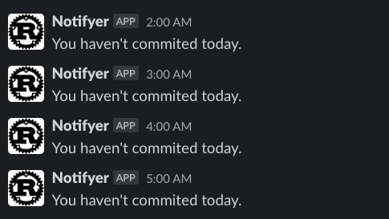
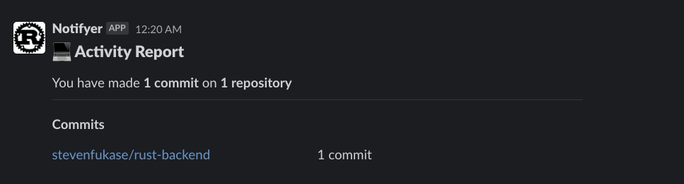

# Notifyer

Rustで作ったRaspberry Piでも動くGitHubの更新状況をCronで指定した時間にSlackで通知するミニCLIアプリ

## 目的

- 購入したRaspberry Pi Zero 2 Wの有効活用
- Linux、Rustの学習

## 機能

### GitHubを更新してないときに通知する

```shell
./notifyer notify
```



### 1日のコミットのサマリー

```shell
# 同日のコミット状況を通知する
./notifyer summary

# 前日の場合 (24時を回ったあとに通知するときに便利)
./notifyer summary_yesterday
```



## 設定手順

1. Githubの準備  
[GithubでPersonal access tokenを発行](https://github.com/settings/tokens)する

1. Slackの準備  
Slackアプリを作り、channel IDとBot User OAuth Tokenを取得する
    - [Slackアプリを作成](https://api.slack.com/apps)
    - [Channel IDの取得方法](https://api.slack.com/messaging/sending)

1. 環境変数の設定  
config.example.tomlを参考に上記で取得したものを.cargo/config.tomlに入れる

1. Cross compileの準備  
Linkerをインストールし、rustupにtoolchainを追加する

    ```shell
    brew install arm-linux-gnueabihf-binutils
    rustup target add armv7-unknown-linux-gnueabihf
    ```

1. Compileする  
下記またはcross_compile.shを実行する

    ```shell
    cargo build --release --target=armv7-unknown-linux-gnueabihf
    ```

1. scpでRaspberry Piにバイナリファイル送信する
1. crontabでスケジュールする  
    (例)

    ```shell
    # 0時を回ったら1日のまとめを通知する
    0 0 * * * cd Projects && ./notifyer summary_yesterday

    # 1時から23時まで1時間毎にGitHubを更新してなかったら通知する
    0 1-23 * * * cd Projects && ./notifyer notify
    ```
